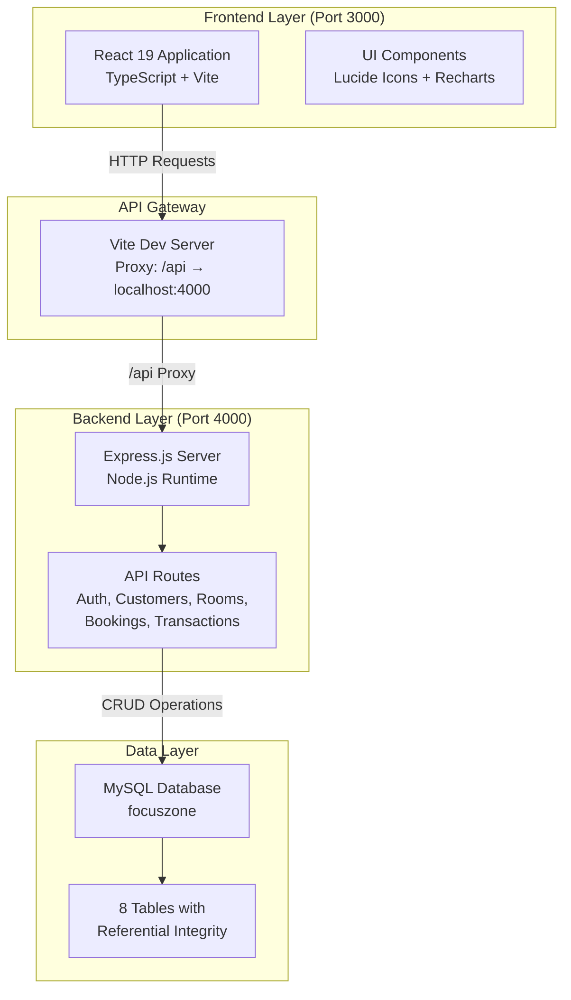
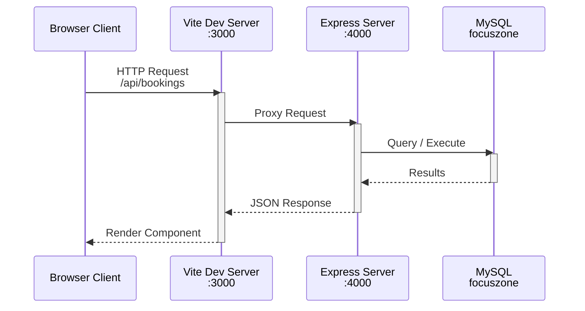
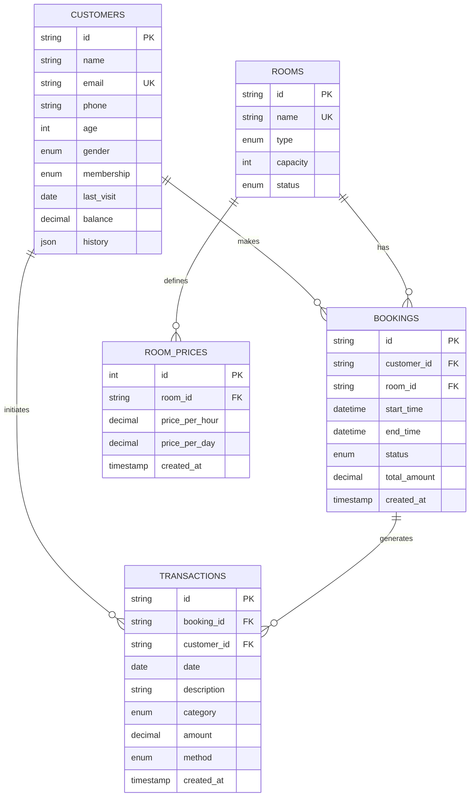
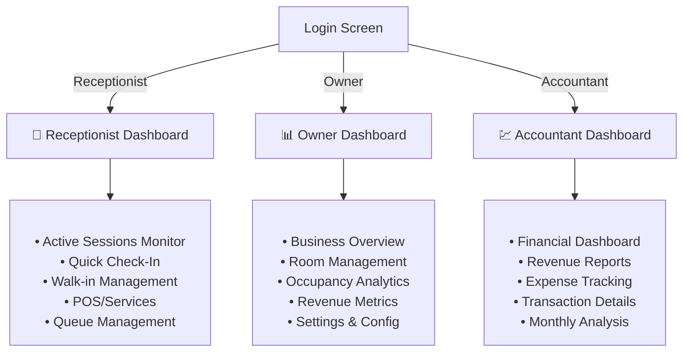

# FocusZone - Coworking Space Management System

## 📋 Project Overview

**FocusZone** is a full-stack **coworking space management dashboard** built with modern technologies. It provides comprehensive functionality for managing room bookings, customer relationships, employee operations, payments, and financial analytics for shared workspace facilities.

### Key Capabilities
- 🏢 **Multi-room management** with dynamic pricing (Private Offices, Meeting Rooms, Hot Desks, Conference Halls)
- 📅 **Advanced booking system** with real-time reservation and cancellation
- 💰 **Payment processing** supporting multiple payment methods (Card, Cash, Transfer)
- 👥 **Customer management** with membership tiers (Basic, Premium, Enterprise)
- 📊 **Financial analytics** and transaction tracking
- 🔐 **Role-based access control** (Receptionist, Owner, Accountant)
- 📱 **Responsive dashboard** with data visualization

### Project Statistics
- **10+ interactive screens** with role-specific views
- **5 main API route groups** handling all business logic
- **8 database tables** with referential integrity constraints
- **React + TypeScript** frontend with Vite build tool
- **Express.js** backend with MySQL database

---

## 🛠️ Technology Stack

### Frontend
| Technology | Version | Purpose |
|-----------|---------|---------|
| **React** | 19.2.1 | UI library for building interactive dashboards |
| **TypeScript** | 5.8.2 | Static typing for type-safe development |
| **Vite** | 6.2.0 | Lightning-fast build tool and dev server |
| **Lucide React** | 0.556.0 | Icon library with 1000+ professional icons |
| **Recharts** | 3.5.1 | Composable charting library for analytics |
| **React-DOM** | 19.2.1 | React DOM rendering engine |

### Backend
| Technology | Version | Purpose |
|-----------|---------|---------|
| **Node.js** | Latest | JavaScript runtime environment |
| **Express.js** | 4.18.4 | Minimal web framework for REST APIs |
| **CORS** | 2.8.5 | Cross-Origin Resource Sharing middleware |
| **MySQL2** | 3.6.0 | MySQL driver with Promise support |

### Database
| Component | Details |
|-----------|---------|
| **Type** | MySQL 5.7+ |
| **Database** | `focuszone` with UTF-8MB4 encoding |
| **Tables** | 8 relational tables with InnoDB engine |
| **Constraints** | Foreign key relationships with referential integrity |

### Development Tools
| Tool | Version | Purpose |
|------|---------|---------|
| **@vitejs/plugin-react** | 5.0.0 | Fast Refresh support for React in Vite |
| **@types/node** | 22.14.0 | TypeScript definitions for Node.js |

---

## 🏗️ Architecture Overview

### System Architecture



### Request Flow Diagram



### Entity Relationship Diagram



---

## 📦 Setup & Installation

### Prerequisites
- **Node.js** (v16+ recommended) - [Download](https://nodejs.org/)
- **MySQL Server** (5.7+) - [Download](https://dev.mysql.com/downloads/)
- **npm** (comes with Node.js)
- **Git** (optional, for version control)

### Step 1: Clone & Install Dependencies

```bash
# Navigate to project directory
cd d:\Front-end\Focus\focuszone

# Install frontend dependencies
npm install

# Install backend dependencies (if separate node_modules)
cd server
npm install
cd ..
```

### Step 2: Database Setup

```bash
# 1. Open MySQL client
mysql -u root -p

# 2. Import the database schema
source FocusZone.sql

# 3. Verify database creation
USE focuszone;
SHOW TABLES;
```

### Step 3: Environment Configuration

Create a `.env` file in the project root with the following variables:

```env
# MySQL Database Configuration
DB_HOST=localhost
DB_USER=root
DB_PASSWORD=your_password_here
DB_NAME=focuszone
DB_PORT=3306

# Backend Server
BACKEND_PORT=4000

# Frontend API Base URL
VITE_API_URL=http://localhost:4000/api

# Gemini API (optional - for AI features)
GEMINI_API_KEY=your_gemini_api_key_here
```

### Step 4: Run Development Servers

**Terminal 1 - Frontend (Vite Dev Server on port 3000):**
```bash
npm run dev
```

**Terminal 2 - Backend (Express on port 4000):**
```bash
npm run start:server
```

### Access Application

```
Frontend: http://localhost:3000
Backend API: http://localhost:4000/api
```

### Build for Production

```bash
# Build frontend
npm run build

# Preview production build
npm run preview
```

---

## 🗄️ Database Schema

### Table: `customers`
Stores customer/member profiles with membership information and wallet balance.

```sql
CREATE TABLE customers (
  id VARCHAR(36) PRIMARY KEY,           -- UUID
  name VARCHAR(120) NOT NULL,           -- Full name
  email VARCHAR(150) NOT NULL UNIQUE,   -- Contact email
  phone VARCHAR(30) NOT NULL,           -- Phone number
  age TINYINT UNSIGNED NOT NULL,        -- Age in years
  gender ENUM('Male', 'Female'),        -- Gender
  membership ENUM('Basic', 'Premium', 'Enterprise'), -- Membership tier
  last_visit DATE,                      -- Last visit date
  balance DECIMAL(10,2),                -- Wallet balance
  history JSON,                         -- Visit/booking history
  created_at TIMESTAMP DEFAULT CURRENT_TIMESTAMP
);
```

**Key Features:**
- Unique email constraint for authentication
- JSON history field for flexible booking records
- Membership-based pricing differentiation

### Table: `rooms`
Represents physical rooms/spaces available for booking.

```sql
CREATE TABLE rooms (
  id VARCHAR(36) PRIMARY KEY,
  name VARCHAR(120) NOT NULL UNIQUE,    -- Room name
  type ENUM('Private Office', 'Meeting Room', 'Hot Desk', 'Conference Hall'),
  capacity SMALLINT UNSIGNED NOT NULL,  -- Max occupancy
  status ENUM('available', 'occupied', 'maintenance', 'reserved'),
  created_at TIMESTAMP DEFAULT CURRENT_TIMESTAMP
);
```

**Status Values:**
- `available`: Open for booking
- `occupied`: Currently in use
- `maintenance`: Under maintenance
- `reserved`: Pre-booked, not available

### Table: `room_prices`
Dynamic pricing for each room (hourly and daily rates).

```sql
CREATE TABLE room_prices (
  id INT AUTO_INCREMENT PRIMARY KEY,
  room_id VARCHAR(36) NOT NULL,
  price_per_hour DECIMAL(10,2) NOT NULL,
  price_per_day DECIMAL(10,2) NOT NULL,
  created_at TIMESTAMP DEFAULT CURRENT_TIMESTAMP,
  CONSTRAINT fk_room_price_room FOREIGN KEY (room_id) 
    REFERENCES rooms(id) ON DELETE CASCADE,
  UNIQUE KEY uq_room_price_room (room_id)
);
```

**Design Notes:**
- One price record per room (unique constraint)
- Supports both hourly and daily billing
- Automatic cascade delete when room is deleted

### Table: `bookings`
Customer room reservations with temporal constraints.

```sql
CREATE TABLE bookings (
  id VARCHAR(36) PRIMARY KEY,
  customer_id VARCHAR(36) NOT NULL,
  room_id VARCHAR(36) NOT NULL,
  start_time DATETIME NOT NULL,
  end_time DATETIME NOT NULL,
  status ENUM('active', 'upcoming', 'completed', 'cancelled'),
  total_amount DECIMAL(10,2) NOT NULL,
  created_at TIMESTAMP DEFAULT CURRENT_TIMESTAMP,
  CONSTRAINT fk_bookings_customer FOREIGN KEY (customer_id) 
    REFERENCES customers(id) ON DELETE RESTRICT,
  CONSTRAINT fk_bookings_room FOREIGN KEY (room_id) 
    REFERENCES rooms(id) ON DELETE RESTRICT
);
```

**Status Lifecycle:**
1. `upcoming` → booking confirmed, pending start time
2. `active` → booking started, room is occupied
3. `completed` → booking ended successfully
4. `cancelled` → booking cancelled before start time

### Table: `transactions`
Complete financial audit trail of all money movements.

```sql
CREATE TABLE transactions (
  id VARCHAR(36) PRIMARY KEY,
  booking_id VARCHAR(36) NULL,          -- Associated booking
  customer_id VARCHAR(36) NULL,         -- Associated customer
  date DATE NOT NULL,                   -- Transaction date
  description VARCHAR(255) NOT NULL,   -- Transaction details
  category ENUM('Income', 'Expense'),   -- Income or Expense
  amount DECIMAL(10,2) NOT NULL,        -- Transaction amount
  method ENUM('Card', 'Cash', 'Transfer'), -- Payment method
  created_at TIMESTAMP DEFAULT CURRENT_TIMESTAMP,
  CONSTRAINT fk_transactions_booking FOREIGN KEY (booking_id) 
    REFERENCES bookings(id) ON DELETE SET NULL,
  CONSTRAINT fk_transactions_customer FOREIGN KEY (customer_id) 
    REFERENCES customers(id) ON DELETE SET NULL
);
```

**Transaction Categories:**
- **Income**: Booking payments, services, facility rentals
- **Expense**: Maintenance, utilities, employee payroll

### Relationships & Constraints

| Relationship | Type | Details |
|-------------|------|---------|
| Customer → Bookings | 1:N | One customer can have multiple bookings |
| Room → Bookings | 1:N | One room can have multiple bookings |
| Room → Room_Prices | 1:1 | Each room has one price record |
| Booking → Transactions | 1:N | Each booking can generate multiple transactions |
| Customer → Transactions | 1:N | Customer can have transaction history |

---

## 🔌 API Routes & Endpoints

### Base URL
```
Development: http://localhost:4000/api
Production: [your-production-domain]/api
```

### Authentication Routes
**File:** `server/routes/auth.js`

| Method | Endpoint | Purpose |
|--------|----------|---------|
| POST | `/api/auth/login` | User authentication & session creation |
| POST | `/api/auth/logout` | End user session |
| POST | `/api/auth/refresh` | Refresh authentication token |

### Customers Routes
**File:** `server/routes/customers.js`

| Method | Endpoint | Purpose |
|--------|----------|---------|
| GET | `/api/customers` | Fetch all customers |
| GET | `/api/customers/:id` | Get customer details & history |
| POST | `/api/customers` | Create new customer |
| PUT | `/api/customers/:id` | Update customer profile |
| DELETE | `/api/customers/:id` | Delete customer record |
| GET | `/api/customers/:id/balance` | Check wallet balance |
| PUT | `/api/customers/:id/balance` | Update wallet balance |

### Rooms Routes
**File:** `server/routes/rooms.js`

| Method | Endpoint | Purpose |
|--------|----------|---------|
| GET | `/api/rooms` | Fetch all rooms with availability |
| GET | `/api/rooms/:id` | Get room details & pricing |
| POST | `/api/rooms` | Create new room |
| PUT | `/api/rooms/:id` | Update room details |
| DELETE | `/api/rooms/:id` | Delete room |
| PUT | `/api/rooms/:id/status` | Update room status |
| GET | `/api/rooms/:id/availability` | Check room availability window |

### Bookings Routes
**File:** `server/routes/bookings.js`

| Method | Endpoint | Purpose |
|--------|----------|---------|
| GET | `/api/bookings` | Fetch all bookings with filters |
| GET | `/api/bookings/:id` | Get booking details |
| POST | `/api/bookings` | Create new booking |
| PUT | `/api/bookings/:id` | Update booking details |
| DELETE | `/api/bookings/:id` | Cancel booking |
| GET | `/api/bookings/room/:roomId` | Get bookings for specific room |
| GET | `/api/bookings/customer/:customerId` | Get customer's bookings |

### Transactions Routes
**File:** `server/routes/transactions.js`

| Method | Endpoint | Purpose |
|--------|----------|---------|
| GET | `/api/transactions` | Fetch all transactions with filters |
| GET | `/api/transactions/:id` | Get transaction details |
| POST | `/api/transactions` | Create transaction record |
| GET | `/api/transactions/report/summary` | Financial summary report |
| GET | `/api/transactions/report/daily` | Daily revenue report |
| GET | `/api/transactions/report/monthly` | Monthly revenue report |

### Error Handling

All endpoints return consistent error responses:

```json
{
  "error": "Error message",
  "code": "ERROR_CODE",
  "timestamp": "2026-06-01T10:30:00Z"
}
```

**Common Status Codes:**
- `200` - Successful operation
- `201` - Resource created
- `400` - Bad request (validation error)
- `401` - Unauthorized (authentication required)
- `403` - Forbidden (permission denied)
- `404` - Not found
- `500` - Server error

---

## 🎨 Frontend Features & Screens

### Role-Based Dashboard System

The application implements three distinct role-based views with specialized dashboards:



### Screen Components

| Screen | Role | Purpose | Key Features |
|--------|------|---------|--------------|
| **Login** | All | Authentication | Email/password auth, role selection |
| **Receptionist Dashboard** | Receptionist | Operations Hub | Real-time session view, quick stats |
| **Make Booking** | Receptionist | Reservation Management | Calendar picker, customer search, confirmation |
| **Check-In** | Receptionist | Entry Management | QR code scan, session creation, payment |
| **Services / POS** | Receptionist | Point of Sale | Item inventory, cart, transaction processing |
| **Owner Dashboard** | Owner | Business Overview | KPIs, charts, occupancy rates |
| **Rooms Management** | Owner | Room Configuration | Add/edit rooms, pricing, status management |
| **Customers** | All | Customer CRM | Directory, profiles, search, history |
| **Reports** | Owner/Accountant | Analytics | Charts, trends, export capability |
| **Financial Reports** | Accountant | Financial Analysis | Revenue, expenses, profit margins |
| **Settings** | Owner | Configuration | System preferences, user management |

### Frontend Architecture

```
src/
├── App.tsx                          # Main app component with routing
├── components/
│   └── Common.tsx                   # Shared UI components
├── screens/                         # Page-level components
│   ├── Login.tsx
│   ├── ReceptionDashboard.tsx
│   ├── OwnerDashboard.tsx
│   ├── AccountantDashboard.tsx
│   ├── Booking.tsx
│   ├── CheckIn.tsx
│   ├── Customers.tsx
│   ├── RoomsManagement.tsx
│   ├── Reports.tsx
│   ├── Settings.tsx
│   └── [additional screens]
├── services/
│   └── api.ts                       # API client with axios/fetch
├── types.ts                         # TypeScript interfaces
├── constants.ts                     # App constants & config
└── App.tsx                          # Main entry point
```

### UI/UX Highlights

- **Responsive Design**: Optimized for desktop, tablet, and mobile
- **Dark Mode Support**: Secondary-900 color scheme for reduced eye strain
- **Icon System**: Lucide React icons for consistent, professional UI
- **Data Visualization**: Recharts for interactive charts and graphs
- **Role-Based Navigation**: Sidebar dynamically populates based on user role
- **Real-time Updates**: WebSocket support for live session tracking
- **Accessibility**: ARIA labels and keyboard navigation support

---

## 🚀 Key Features & Business Logic

### 1. Booking Management System

**Features:**
- Real-time room availability checking
- Flexible booking duration (hourly/daily options)
- Automatic price calculation based on room type and duration
- Booking status lifecycle (upcoming → active → completed/cancelled)
- Automatic confirmation and reminder notifications

**Business Rules:**
```
- Minimum booking duration: 1 hour
- Maximum booking duration: 30 days
- Cancellation allowed up to 2 hours before start
- Pricing: calculated from room_prices table
- Double-booking prevention: SQL constraints enforce unique time windows
```

### 2. Payment Processing

**Supported Methods:**
- 💳 Card (Visa, Mastercard)
- 💵 Cash (on-site payment)
- 📱 Wallet Transfer (customer balance)

**Payment Flow:**
```
1. Customer selects room and books time slot
2. System calculates total_amount from room_prices
3. Payment method selected at check-in
4. Transaction recorded with booking_id reference
5. Customer balance updated (wallet transfers)
6. Receipt generated and emailed
```

### 3. Membership Management

**Tiers:** Basic, Premium, Enterprise

**Benefits:**
| Feature | Basic | Premium | Enterprise |
|---------|-------|---------|-----------|
| Room Access | Standard hours | 24/7 access | 24/7 priority |
| Pricing | Hourly rates | 10% discount | 20% discount |
| Reports | Limited | Full | Custom |
| Support | Email | Priority | Dedicated |

### 4. Financial Tracking

**Income Categories:**
- Room bookings (primary revenue)
- Service fees (POS items)
- Late fees (if applicable)

**Expense Categories:**
- Maintenance & repairs
- Utilities & supplies
- Employee payroll
- Lease/facility costs

**Reports Generated:**
- Daily revenue report
- Monthly financial summary
- Year-to-date analysis
- Profit margin calculations
- Expense breakdowns

### 5. Session Management

**Session Lifecycle:**
```
Customer Booking
    ↓
Check-In (Receptionist scans/confirms)
    ↓
Session Active (Real-time monitoring)
    ↓
Add Services/POS items (Optional)
    ↓
Check-Out (End session)
    ↓
Payment Processing
    ↓
Transaction Recorded
    ↓
Session Completed
```

---

## 🔒 Security Considerations

### Authentication
- Email/password authentication (implement JWT tokens)
- Role-based access control (RBAC) on all API routes
- Session management with expiration (recommend 24-hour timeout)

### Data Protection
- MySQL connections use encrypted credentials from `.env`
- SQL injection prevention via parameterized queries (mysql2 prepared statements)
- CORS enabled only for trusted frontend origin

### Recommendations
- Implement HTTPS in production
- Use environment variables for all sensitive data
- Add rate limiting to prevent API abuse
- Log all financial transactions for audit trail
- Implement password hashing (bcrypt recommended)
- Add two-factor authentication for admin/accountant roles

---

## 📊 Development Workflow

### npm Scripts

```bash
# Development
npm run dev              # Start Vite dev server on :3000
npm run start:server    # Start Express backend on :4000

# Production
npm run build           # Build optimized frontend (dist/)
npm run preview         # Preview production build locally

# Database
source FocusZone.sql    # Initialize database
```

### Project Structure Overview

```
focuszone/
├── 📄 DOCUMENTATION.md          # This file
├── 📄 package.json              # Dependencies & scripts
├── 📄 vite.config.ts            # Vite configuration
├── 📄 tsconfig.json             # TypeScript configuration
├── 📄 FocusZone.sql             # Database schema
├── 📄 .env.example              # Environment variables template
│
├── 📁 src/                      # Frontend source code
│   ├── App.tsx                  # Main application component
│   ├── types.ts                 # TypeScript interfaces
│   ├── constants.ts             # Application constants
│   ├── index.tsx                # React entry point
│   ├── 📁 components/           # Reusable UI components
│   ├── 📁 screens/              # Page components (role-based views)
│   └── 📁 services/             # API services & utilities
│
├── 📁 server/                   # Backend source code
│   ├── index.js                 # Express server setup
│   ├── db.js                    # Database connection pool
│   ├── import-sql.js            # Database initialization
│   └── 📁 routes/               # API endpoint handlers
│       ├── auth.js              # Authentication endpoints
│       ├── customers.js         # Customer management
│       ├── rooms.js             # Room operations
│       ├── bookings.js          # Booking management
│       ├── sessions.js          # Active sessions
│       ├── employees.js         # Employee management
│       ├── items.js             # POS items
│       ├── payments.js          # Payment processing
│       └── transactions.js      # Financial transactions
│
└── 📁 public/                   # Static assets
```

---

## 🎯 Performance Optimization

### Frontend Optimizations
- **Code Splitting**: Vite automatically chunks components for lazy loading
- **Tree Shaking**: Unused code removed during build
- **Image Optimization**: Lucide icons are SVG-based (lightweight)
- **Memoization**: React.memo for expensive components (dashboards)
- **State Management**: Recommend Redux or Zustand for large state

### Backend Optimizations
- **Database Indexing**: Add indexes on frequently queried fields
  ```sql
  CREATE INDEX idx_customer_email ON customers(email);
  CREATE INDEX idx_booking_customer ON bookings(customer_id);
  CREATE INDEX idx_booking_room ON bookings(room_id);
  CREATE INDEX idx_transaction_date ON transactions(date);
  ```
- **Query Optimization**: Use pagination for large result sets
- **Caching**: Implement Redis for session caching
- **Connection Pooling**: mysql2 provides built-in connection pooling

### Recommended Additions
- Add monitoring/logging (Winston or Pino)
- Implement API rate limiting (express-rate-limit)
- Add input validation (joi or zod)
- Setup automated testing (Jest, React Testing Library)

---

## 🚢 Deployment

### Frontend Deployment Options

**Static Hosting (Recommended)**
- Vercel: `vercel deploy`
- Netlify: Drag & drop `dist/` folder
- GitHub Pages: `npm run build` + deploy dist/

**Example (Vercel):**
```bash
npm install -g vercel
npm run build
vercel
```

### Backend Deployment Options

**Cloud Platforms**
- **Heroku**: `git push heroku main`
- **Railway**: Connect GitHub repo
- **AWS EC2**: Ubuntu + Node.js setup
- **DigitalOcean**: App Platform or Droplet

**Docker Containerization (Recommended)**
```dockerfile
FROM node:18-alpine
WORKDIR /app
COPY package*.json ./
RUN npm ci --only=production
COPY . .
EXPOSE 4000
CMD ["node", "server/index.js"]
```

### Environment Variables in Production

```env
# Database
DB_HOST=your-production-db-host
DB_USER=prod_user
DB_PASSWORD=strong_password_here
DB_NAME=focuszone

# Server
BACKEND_PORT=4000
NODE_ENV=production

# API
VITE_API_URL=https://api.yourdomain.com

# Security
JWT_SECRET=your-jwt-secret-key
GEMINI_API_KEY=your-api-key
```

---

## 📝 Development Guidelines

### TypeScript Best Practices
- Define types in [types.ts](types.ts) for all data models
- Use strict mode: `"strict": true` in tsconfig.json
- Avoid `any` type—use generics and unions instead

### Component Organization
- One component per file
- Keep components focused and reusable
- Use custom hooks for shared logic

### API Consumption Pattern
- Centralize API calls in [services/api.ts](services/api.ts)
- Use error handling for all requests
- Implement loading and error states

### Naming Conventions
- Components: PascalCase (e.g., `CustomerDashboard`)
- Functions/variables: camelCase (e.g., `fetchCustomers`)
- Constants: UPPER_SNAKE_CASE (e.g., `API_BASE_URL`)
- Database columns: snake_case (e.g., `created_at`)

---

## 🐛 Troubleshooting

### Common Issues

**Issue: "Cannot find module 'mysql2'"**
```bash
# Solution: Install backend dependencies
cd server && npm install && cd ..
```

**Issue: "Port 3000/4000 already in use"**
```bash
# Kill process on port
npx kill-port 3000 4000
# Or specify different port in vite.config.ts or server/index.js
```

**Issue: "CORS error when calling /api endpoints"**
```javascript
// Verify CORS is enabled in server/index.js
app.use(cors());

// Check proxy configuration in vite.config.ts
proxy: {
  '/api': {
    target: 'http://localhost:4000',
    changeOrigin: true,
  }
}
```

**Issue: "MySQL connection refused"**
```bash
# Verify MySQL is running
# Windows: Check Services app or run: mysql -u root -p
# Mac: brew services start mysql
# Linux: sudo systemctl start mysql
```

**Issue: "Database import failed"**
```bash
# Verify database creation
mysql -u root -p < FocusZone.sql

# Check if database exists
mysql -u root -p -e "SHOW DATABASES;"
```

---

## 📚 Additional Resources

### Documentation Links
- [React Documentation](https://react.dev)
- [TypeScript Handbook](https://www.typescriptlang.org/docs/)
- [Vite Guide](https://vitejs.dev/guide/)
- [Express.js API](https://expressjs.com/)
- [MySQL Documentation](https://dev.mysql.com/doc/)

### Tools & Extensions
- **VS Code**: Install extensions
  - ES7+ React/Redux/React-Native snippets
  - Prettier - Code formatter
  - ES Lint
  - Thunder Client or Postman (API testing)

- **MySQL**: GUI clients
  - MySQL Workbench
  - DBeaver
  - phpMyAdmin

---

## 📝 License & Credits

**Project**: FocusZone Coworking Management System  
**Version**: 0.0.0  
**Last Updated**: June 2026

---

## 🎓 Learning Outcomes

This project demonstrates expertise in:

✅ **Full-Stack Development**: React → Express → MySQL integration  
✅ **TypeScript**: Strong typing across frontend and backend  
✅ **Database Design**: Normalized schema with referential integrity  
✅ **REST API Design**: RESTful endpoints following best practices  
✅ **Role-Based Access Control**: Multi-tenant user management  
✅ **Financial Systems**: Transaction tracking and reporting  
✅ **Real-time UI**: Dashboard updates and data visualization  
✅ **DevOps Basics**: Environment configuration and deployment readiness  

---

**For questions or contributions**, refer to the project repository or contact the development team.
